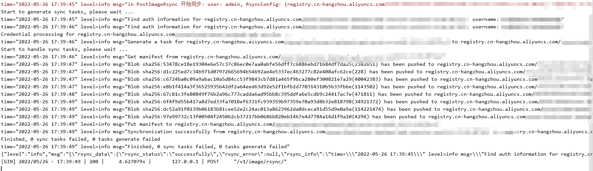

# README
- image rsync service
- project default URL: http://127.0.0.1:8080/


### Usage
```
./build/imagersync_service_bin --address 0.0.0.0:8080 --configFile configs/config.yaml
      --address string      service run address, default :8080 (default "0.0.0.0:8080")
      --configFile string   service run config file (default "configs/config.yaml")
```

### build/deploy
- build package
```
# 执行 go build, 并制作 images
bash cmd/linux_build.sh
```

- systemd service
```
cp build/imagersync-servuce.service /etc/systemd/system/imagersync-service.service
systemctl daemon-reload
systemctl enable --now imagersync-servuce
systemctl status imagersync-servuce
```

### Case
- Info


---
### 设计方案
- 系统图


#### API 协议设计
##### 1. GET /
- hello work

##### 2. GET /check
- service status check

##### 3. POST /v1/image/rsync
- 镜像同步 API
- Request Body
```json
{
    "rsync_config": {
        "source": "registry.cn-hangzhou.aliyuncs.com/doumeng:v1.0",
        "target": "registry.cn-hangzhou.aliyuncs.com/doumeng:v1.0"
    }
}
```
- Request Auth Basic
```
Username: doumeng
Username: doumeng
```
- Response Body
```json
{
    "rsync_data": {
        "rsync_status": "successfully",
        "rsync_error": null,
        "rsync_info": "time=\"2022-05-26 17:39:45\" level=info msg=\"Find auth information for registry.cn-hangzhou.aliyuncs.com/doumeng:v1.0, username: xxx... level=info msg=\"Synchronization successfully from registry.cn-hangzhou.aliyuncs.com/doumeng:v1.0 to registry.cn-hangzhou.aliyuncs.com/doumeng:v1.0\"\ntime=\"2022-05-26 17:39:49\" level=info msg=\"Finished, 0 sync tasks failed, 0 tasks generate failed\"\n",
        "start_time": "2022-05-26T17:39:45.3004003+08:00",
        "end_time": "2022-05-26T17:39:49.9274793+08:00",
        "duration_time_seconds": 4.627079
    },
    "rsync_config": {
        "source": "registry.cn-hangzhou.aliyuncs.com/doumeng:v1.0",
        "target": "registry.cn-hangzhou.aliyuncs.com/doumeng:v1.0"
    },
    "username": "doumeng"
}
```
